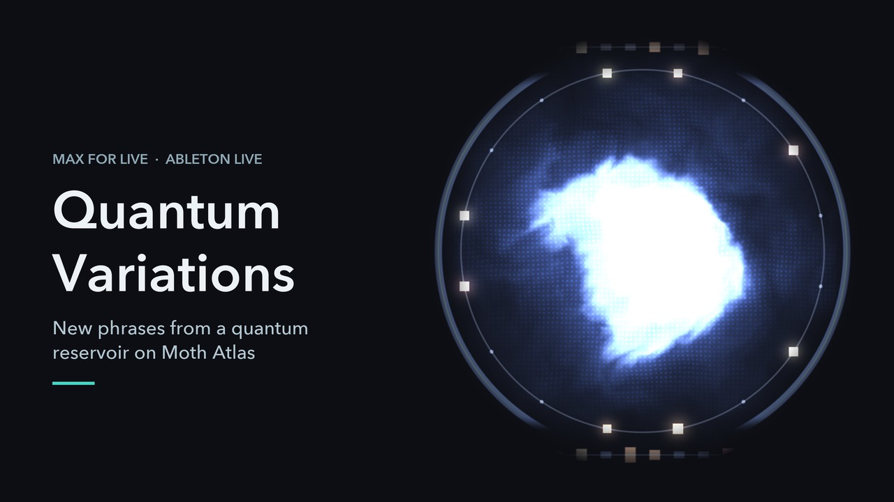

# Quantum Variations

A Max for Live MIDI effect for Ableton Live. It learns the phrase in a MIDI clip on a quantum reservoir, then writes new variations of it back into your set as ordinary MIDI clips.

Built on [Moth Quantum](https://mothquantum.com)'s Atlas engines `qrc-train-v2` and `qrc-gen-v2` (quantum reservoir computing). Made for Moth Hack 2026, challenge 7: Make a VST or AU.

**[How it works, interactively →](https://digitalbath.github.io/quantum-pond/)** A pond stands in for the qubits: drop stones, tap a rhythm, fit a readout and let it play on.

## How it works

1. **Learn Clip** reads a MIDI clip from your set - a melody, chords or drums.
2. The phrase is trained on a quantum reservoir with `qrc-train-v2`.
3. **Generate** runs `qrc-gen-v2`, carrying on from where your clip leaves off, different every time.
4. The **Variation** dial sets how far the new phrase strays from the original.
5. The result lands in the next empty clip slot as an ordinary MIDI clip, keeping the feel of your playing. Your original is never touched.

The reservoir itself is never trained, only a linear readout on top of it. Every note that comes back has passed through a measurement.

## Setup

Needs Ableton Live Suite, or Live Standard with the Max for Live add-on, and a Moth Atlas API key from [platform.mothquantum.com](https://platform.mothquantum.com).

1. Keep `QuantumVariations.amxd`, `quantum.js`, `live.js` and `quantum.jxs` together in one folder.
2. Drag `QuantumVariations.amxd` onto a MIDI track.
3. Open **Settings** on the device, paste your API key and press Save. It's checked against the API, then stored outside the Live set in `~/Library/Application Support/QuantumMIDI/config.json` (`%APPDATA%\QuantumMIDI` on Windows).

Then select a clip, press **Learn Clip**, choose the phrase length and Variation, and press **Generate**. Learning takes about a minute the first time; re-learning an unchanged clip is instant, since trained models are cached. A phrase takes a few seconds.

## Source modes

- **Notes** - one line, a melody or a bassline. Each sixteenth step is the pitch that starts there, or a rest.
- **Chords** and **Drums** - each step is the set of notes that starts there: a voicing or a hit combination.

The mode is picked automatically when you learn a clip (Drums when the track has a Drum Rack), and you can override it. Velocities, lengths and voicings are remembered per step, so generated clips keep the articulation of the source.

## How it's built

Two scripts, because Node for Max can't reach the Live API and Max's `js` object can't do HTTP well. They talk through the patcher.

- `quantum.js` runs in `node.script`. All Atlas API calls and the device state. No dependencies, and it runs on the Node bundled with Max 8.
- `live.js` runs in a `js` object (ES5). Reads the clip and writes new ones through the Live API.
- `quantum.jxs` is the GLSL display: the reservoir drawn as a sphere that Variation distorts, circled by the steps of the phrase and lit by Live's playhead.

A generated phrase is one Atlas job. `qrc-gen-v2` is warmed up on the end of your clip (`initial_events`) so it continues your phrase, with a fresh `random_seed` each time.

### Tools

- `tools/build_device.py` - generates the `.amxd` patcher from code, so layout and wiring are reviewable.
- `tools/check_shader.py` - compiles the shader with `glslangValidator` (`brew install glslang`). Max compiles silently, so run this after any shader change.
- `tools/render_shader.py` - renders the shader offscreen with any parameters (needs PyOpenGL, glfw, pillow).
- `tools/test_live.js` - runs `live.js` against a fake Live API: `node tools/test_live.js`.

For development, a `.env` file next to `quantum.js` containing `MOTH_API_KEY=...` overrides the stored key. It's gitignored.

## Author

[Jo Portus](https://joport.us)
